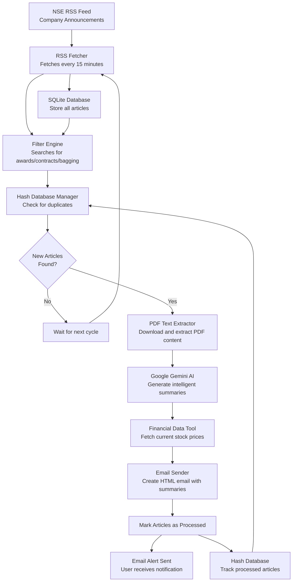

# NSE RSS Awards Processing System

## The Problem This Solves

When companies announce new orders, contracts, or awards, their stock prices often increase by 2-5% within the next 3 days. However, manually monitoring NSE announcements for these opportunities is time-consuming and inefficient. By the time you manually discover these announcements, the price movement may have already occurred.

**Real Examples:**
- Company A announces Rs. 500 crore defense contract → Stock jumps 4% in 2 days
- Company B bags Rs. 200 crore infrastructure order → Stock rises 3% overnight
- Company C wins major export deal → Stock gains 6% in first trading session

## The Solution

This automated system monitors NSE RSS feeds 24/7, instantly identifies new awards/contracts/bagging announcements, and sends you email alerts with AI-generated summaries and current stock prices. This gives you a significant time advantage to make informed investment decisions.

**What You Get:**
- Instant email alerts when relevant announcements are published
- AI-powered summaries extracting key information (order value, client, timeline)
- Current stock price and financial metrics
- Direct links to original PDF documents
- No more manual browsing through hundreds of announcements

## How It Works



## Key Features

- **Automated Monitoring**: Checks NSE announcements every 15 minutes
- **Smart Filtering**: Identifies awards, bagging, and contract announcements using keyword matching
- **AI-Powered Summaries**: Uses Google Gemini AI to summarize PDF documents with key details like order value, client, and expiry
- **Financial Data Integration**: Fetches current stock prices and financial metrics
- **Email Alerts**: Sends formatted HTML email notifications with summaries and clickable links
- **Duplicate Prevention**: Tracks processed articles to avoid repeat notifications
- **Robust Error Handling**: Comprehensive logging and error recovery mechanisms
- **Modular Architecture**: Clean, maintainable code with separate components

## Prerequisites

- Python 3.8 or higher
- Google Gemini API key (for PDF summarization)
- Email account with SMTP access (Gmail, Outlook, Yahoo, or iCloud)
- 2GB+ available disk space

## Installation

### 1. Clone or Download the Project

```bash
git clone <repository-url>
cd email_system
```

### 2. Create a Virtual Environment (Recommended)

```bash
python -m venv market_env
source market_env/bin/activate  # On Windows: market_env\Scripts\activate
```

### 3. Install Dependencies

```bash
pip install -r requirements.txt
```

### 4. Environment Configuration

Create a `.env` file in the project root with your configuration:

```env
# Email Configuration
SENDER_EMAIL=your-email@gmail.com
SENDER_PASSWORD=your-app-specific-password
RECIPIENT_EMAIL=recipient@example.com
EMAIL_PROVIDER=gmail

# Google Gemini API (for PDF summaries)
GEMINI_API_KEY=your-gemini-api-key

# Optional: Financial Data API
FINANCIAL_API_KEY=your-financial-api-key
```

### 5. Email Setup

#### For Gmail Users:
1. Enable 2-Factor Authentication
2. Generate an App-Specific Password:
   - Go to Google Account settings
   - Security → 2-Step Verification → App passwords
   - Generate password for "Mail"
   - Use this password in your `.env` file

#### For Other Providers:
- **Outlook**: Use your regular password (ensure "Less secure apps" is enabled)
- **Yahoo**: Generate an app password
- **iCloud**: Generate an app-specific password

### 6. Google Gemini API Setup

1. Visit [Google AI Studio](https://makersuite.google.com/app/apikey)
2. Create a new API key
3. Add it to your `.env` file as `GEMINI_API_KEY`

## Usage

### Quick Start (Recommended Approach)

Once you've completed the installation and configuration, start the automated scheduler. This will run continuously and check for new announcements every 15 minutes:

```bash
python scheduler.py
```

**What happens next:**
- The system immediately performs an initial check for new announcements
- It then runs every 15 minutes automatically
- When new awards/contracts are found, you'll receive email alerts within minutes
- Each email contains AI-generated summaries with key details like order value, client, and timeline

Output example:
```
RSS Awards Processor Scheduler
==================================================
Starting RSS Awards Processor Scheduler
Schedule: Every 15 minutes
Email configuration loaded successfully
Running initial check...
Scheduler is now running. Press Ctrl+C to stop.
```

### Manual Execution

Run the processor once manually:

```bash
python rss_awards_processor.py
```

### Testing Components

Test individual components:

```bash
# Test RSS fetching
python rss_fetcher.py

# Test email sending
python email_sender.py

# Test PDF summarization
python pdf_summarizer.py <pdf-url>
```

## Project Structure

```
email_system/
├── README.md                    # This file
├── requirements.txt             # Python dependencies
├── config.py                   # Configuration settings
├── .env                        # Environment variables (create this)
│
├── scheduler.py                # Main scheduler (entry point)
├── rss_awards_processor.py     # Core processing logic
├── rss_fetcher.py              # RSS feed fetching
├── filter_engine.py            # Article filtering logic
├── email_sender.py             # Email sending functionality
├── pdf_summarizer.py           # PDF text extraction and summarization
├── pdf_text_extractor.py       # PDF text extraction utilities
├── database_manager.py         # Main database operations
├── hash_database_manager.py    # Duplicate tracking
│
├── data/                       # Database files
│   └── rss_articles.db         # SQLite database
├── logs/                       # Log files (auto-created)
├── orderbook_numbers/          # Financial data tools
│   ├── financial_data_tool.py  # Stock data fetching
│   └── gemini_test.py          # AI testing utilities
│
└── __pycache__/               # Python cache (auto-generated)
```

## Configuration

### RSS Feed Settings

Edit `config.py` to customize:

```python
RSS_CONFIG = {
    "url": "http://nsearchives.nseindia.com/content/RSS/Online_announcements.xml",
    "timeout": 30,
    # Custom headers for reliable access
}

SCHEDULER_CONFIG = {
    "fetch_interval_minutes": 15,  # How often to check
    "max_workers": 4,
    "batch_size": 1000,
}
```

### Filter Customization

Modify the filtering logic in `filter_engine.py`:

```python
DEFAULT_FILTERS = {
    "keywords": ["award", "bagging", "contract"],
    "default_filter": "Awards/Bagging",
    "date_range_days": 7,
    "max_results": 100,
}
```

### Email Templates

Customize email appearance in `email_sender.py` - modify HTML templates and styling.

## Features in Detail

### 1. RSS Feed Processing
- Fetches announcements from NSE RSS feed
- Handles connection timeouts and retries
- Stores articles in SQLite database
- Tracks processing statistics

### 2. Smart Filtering
- **Keyword Matching**: Searches for "award", "bagging", "contract" etc.
- **Company Name Extraction**: Identifies company names from titles
- **Date Range Filtering**: Configurable time windows
- **Preset Filters**: Pre-configured filter sets for different use cases

### 3. AI-Powered PDF Summarization
- Automatically detects PDF links in announcements
- Downloads and extracts text from PDFs
- Uses Google Gemini AI for intelligent summarization
- Formats summaries for email display
- Handles large documents with smart truncation

### 4. Financial Data Integration
- Fetches current stock prices
- Gets financial metrics and ratios
- Integrates with financial data APIs
- Handles rate limiting and errors gracefully

### 5. Email Notifications
- Beautiful HTML email formatting
- Company-specific alerts with clickable buttons
- PDF summaries embedded in emails
- Support for multiple email providers
- Attachment support for detailed reports

### 6. Database Management
- **Main Database**: Stores all RSS articles with full metadata
- **Hash Database**: Tracks processed articles to prevent duplicates
- **Automatic Cleanup**: Removes old data to prevent database bloat
- **Error Recovery**: Handles database locks and corruption

## Troubleshooting

### Common Issues

#### 1. Email Authentication Errors
```
Error: Authentication failed
```

**Solutions:**
- Verify email and password in `.env` file
- For Gmail: Use App-Specific Password, not regular password
- Check if 2FA is enabled and configured correctly
- Verify EMAIL_PROVIDER setting matches your email service

#### 2. RSS Feed Access Issues
```
Error: Failed to fetch RSS feed
```

**Solutions:**
- Check internet connection
- NSE RSS feed might be temporarily unavailable
- Verify RSS URL in `config.py`
- Check firewall settings

#### 3. Gemini API Errors
```
Error: Gemini API authentication failed
```

**Solutions:**
- Verify `GEMINI_API_KEY` in `.env` file
- Check API key permissions
- Ensure API quota is not exceeded
- Try regenerating the API key

#### 4. PDF Processing Issues
```
Failed to generate Gemini summary for PDF
```

**Solutions:**
- PDF might be password-protected or corrupted
- Large PDFs might timeout - system handles this gracefully
- Check network connectivity for PDF downloads

#### 5. Database Errors
```
Database locked error
```

**Solutions:**
- Multiple instances might be running - stop all instances
- Database file might be corrupted - delete and restart
- Check file permissions in `data/` directory

### Log Files

Check log files for detailed error information:
- `scheduler.log` - Scheduler-specific logs
- `rss_system.log` - General system logs
- Console output for real-time monitoring

### Debugging Mode

Enable verbose logging by modifying `config.py`:

```python
LOGGING_CONFIG = {
    "level": "DEBUG",  # Change from "INFO" to "DEBUG"
    # ... other settings
}
```

## Security Considerations

1. **Environment Variables**: Never commit `.env` file to version control
2. **App Passwords**: Use app-specific passwords instead of main passwords
3. **API Keys**: Rotate API keys regularly
4. **Database**: Secure database files with appropriate permissions
5. **Network**: Consider running behind a firewall for production use

## Production Deployment

### Using systemd (Linux)

Create a service file `/etc/systemd/system/rss-processor.service`:

```ini
[Unit]
Description=RSS Awards Processor
After=network.target

[Service]
Type=simple
User=your-username
WorkingDirectory=/path/to/email_system
ExecStart=/path/to/email_system/market_env/bin/python scheduler.py
Restart=always
RestartSec=10

[Install]
WantedBy=multi-user.target
```

Enable and start:
```bash
sudo systemctl enable rss-processor
sudo systemctl start rss-processor
```

### Using Docker

Create a `Dockerfile`:

```dockerfile
FROM python:3.9-slim

WORKDIR /app
COPY requirements.txt .
RUN pip install -r requirements.txt

COPY . .
CMD ["python", "scheduler.py"]
```

Build and run:
```bash
docker build -t rss-processor .
docker run -d --env-file .env rss-processor
```

## Performance Optimization

### Database Optimization
- Regular cleanup of old articles
- Database indexing for faster queries
- Batch processing for large datasets

### Network Optimization
- Connection pooling for RSS feeds
- Retry logic with exponential backoff
- Request rate limiting

### Memory Management
- Stream processing for large PDFs
- Garbage collection for long-running processes
- Memory monitoring and alerts

## Contributing

1. Fork the repository
2. Create a feature branch (`git checkout -b feature/new-feature`)
3. Commit changes (`git commit -am 'Add new feature'`)
4. Push to the branch (`git push origin feature/new-feature`)
5. Create a Pull Request

## License

This project is licensed under the MIT License - see the [LICENSE](LICENSE) file for details.

## Support

For issues and questions:
1. Check the troubleshooting section above
2. Review log files for error details
3. Create an issue with detailed error information
4. Include system information and configuration (excluding sensitive data)

## Changelog

### Version 1.0.0
- Initial release with core RSS processing
- Email notifications with PDF summaries
- Automated scheduling
- Financial data integration
- Comprehensive error handling and logging

---

**Made for automated financial news monitoring** 