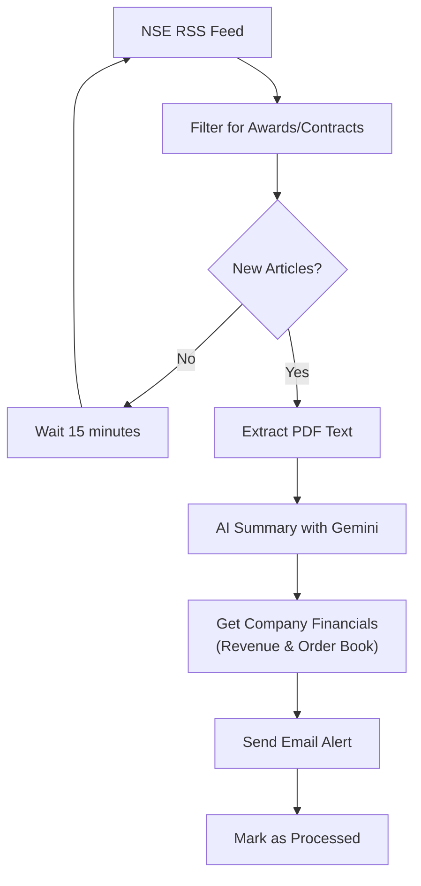

# NSE RSS Awards Processing System

## The Problem This Solves

When companies announce new orders, contracts, or awards, their stock prices often increase by 2-5% within the next 3 days. However, manually monitoring NSE announcements for these opportunities is time-consuming and inefficient. By the time you manually discover these announcements, the price movement may have already occurred.

**Real Examples:**
- Company A announces Rs. 500 crore defense contract → Stock jumps 4% in 2 days
- Company B bags Rs. 200 crore infrastructure order → Stock rises 3% overnight
- Company C wins major export deal → Stock gains 6% in first trading session

## The Solution

This automated system monitors NSE RSS feeds 24/7, instantly identifies new awards/contracts/bagging announcements, and sends you email alerts with AI-generated summaries and current stock prices. This gives you a significant time advantage to make informed investment decisions.

**What You Get:**
- Instant email alerts when relevant announcements are published
- AI-powered summaries extracting key information (order value, client, timeline)
- Company financial context (previous year's revenue, current order book size)
- Direct links to original PDF documents
- No more manual browsing through hundreds of announcements

## How It Works



## Key Features

- **Automated Monitoring**: Checks NSE announcements every 15 minutes
- **Smart Filtering**: Identifies awards, bagging, and contract announcements using keyword matching
- **AI-Powered Summaries**: Uses Google Gemini AI to summarize PDF documents with key details like order value, client, and expiry
- **Financial Context**: Uses Gemini with search grounding to find company revenue and order book data
- **Email Alerts**: Sends formatted HTML email notifications with summaries and clickable links
- **Duplicate Prevention**: Tracks processed articles to avoid repeat notifications
- **Sleep/Wake Detection**: Automatically detects laptop sleep/wake cycles and runs catch-up jobs
- **Background Processing**: Can run as a background service or system daemon
- **Robust Error Handling**: Comprehensive logging and error recovery mechanisms
- **Clean Architecture**: Well-organized codebase with separate modules for different concerns

## Architecture Overview

The codebase is organized into logical modules for better maintainability:

- **`src/core/`** - Main processing logic, scheduling, and filtering
- **`src/data/`** - Database operations, RSS fetching, and data persistence  
- **`src/ai/`** - AI-powered features like PDF summarization and financial data
- **`src/communication/`** - Email notifications and alerts
- **`src/config/`** - Application settings and configuration
- **`tests/`** - Testing utilities and validation tools

This modular structure makes it easy to:
- Understand what each part does
- Modify individual components without affecting others
- Add new features in the appropriate location
- Test components independently

## Prerequisites

- Python 3.8 or higher
- Google Gemini API key (for PDF summarization)
- Email account with SMTP access (Gmail, Outlook, Yahoo, or iCloud)
- 2GB+ available disk space

## Installation

### 1. Clone or Download the Project

```bash
git clone <repository-url>
cd email_system
```

### 2. Create a Virtual Environment (Recommended)

```bash
python -m venv market_env
source market_env/bin/activate  # On Windows: market_env\Scripts\activate
```

### 3. Install Dependencies

```bash
pip install -r requirements.txt
```

### 4. Environment Configuration

Create a `.env` file in the project root with your configuration:

```env
# Email Configuration
SENDER_EMAIL=your-email@gmail.com
SENDER_PASSWORD=your-app-specific-password
RECIPIENT_EMAIL=recipient@example.com
EMAIL_PROVIDER=gmail

# Google Gemini API (for PDF summaries)
GEMINI_API_KEY=your-gemini-api-key

# Optional: Financial Data API
FINANCIAL_API_KEY=your-financial-api-key
```

### 5. Email Setup

#### For Gmail Users:
1. Enable 2-Factor Authentication
2. Generate an App-Specific Password:
   - Go to Google Account settings
   - Security → 2-Step Verification → App passwords
   - Generate password for "Mail"
   - Use this password in your `.env` file

#### For Other Providers:
- **Outlook**: Use your regular password (ensure "Less secure apps" is enabled)
- **Yahoo**: Generate an app password
- **iCloud**: Generate an app-specific password

### 6. Google Gemini API Setup

1. Visit [Google AI Studio](https://makersuite.google.com/app/apikey)
2. Create a new API key
3. Add it to your `.env` file as `GEMINI_API_KEY`

## Usage

### Quick Start Options

The system offers multiple deployment options to suit different needs. Choose the one that works best for your setup:

#### Option 1: Interactive Mode (Simple Start)
Run the scheduler in the foreground (you'll see all logs in real-time):

```bash
python manage_scheduler.py --interactive
```

#### Option 2: Background Process (Recommended for Laptops)
Run the scheduler as a background process that survives terminal closure:

```bash
# Start in background
python manage_scheduler.py --start

# Check status anytime
python manage_scheduler.py --status

# Stop when needed
python manage_scheduler.py --stop
```

#### Option 3: System Service (Most Robust)
Install as a system service for automatic startup and restart:

```bash
# Setup the service
python manage_scheduler.py --setup-service

# Enable automatic startup
sudo systemctl enable rss-scheduler@$USER

# Start the service
sudo systemctl start rss-scheduler@$USER

# Check service status
sudo systemctl status rss-scheduler@$USER
```

### Sleep/Wake Detection Feature

The scheduler includes intelligent sleep/wake detection that automatically handles laptop suspend/resume scenarios:

**How it works:**
- Monitors system heartbeat every minute
- Detects when system has been suspended (gap > 5 minutes)
- Automatically runs catch-up jobs when system wakes up
- Logs sleep detection events for transparency

**Example log output:**
```
⚠️ System sleep detected! Gap: 12847.3s
🔄 Running catch-up job after wake-up...
✅ Processing completed successfully!
   📊 New articles: 2
   💰 Financial data: 1
   📧 Email sent: Yes
```

**What happens during normal operation:**
- The system immediately performs an initial check for new announcements
- It then runs every 15 minutes automatically
- When new awards/contracts are found, you'll receive email alerts within minutes
- Each email contains AI-generated summaries with key details like order value, client, and timeline
- If your laptop goes to sleep, the system automatically catches up when it wakes up

**Sample startup output:**
```
RSS Awards Processor Scheduler
==================================================
🚀 Starting RSS Awards Processor Scheduler
📅 Schedule: Every 15 minutes
💤 Sleep/wake detection: Enabled
✅ Email configuration loaded successfully
✅ Scheduler started successfully
💓 Heartbeat monitor started
🔄 Running initial check...
⏰ Scheduler is now running. Press Ctrl+C to stop.
```

### Legacy Direct Execution

You can still run the processor components directly for testing or one-time execution:

#### Manual Execution
Run the processor once manually:

```bash
python -m src.core.processor
```

#### Direct Scheduler (Legacy)
Run the basic scheduler without management features:

```bash
python -m src.core.scheduler
```

### Testing Components

Test individual components:

```bash
# Test RSS fetching
python -m src.data.rss_fetcher

# Test email sending  
python -m src.communication.email_sender

# Test PDF summarization
python -m src.ai.pdf_summarizer <pdf-url>

# Test AI functionality
python -m tests.gemini_test

# Test scheduler management
python manage_scheduler.py --status
```

## Project Structure

```
email_system/
├── README.md                    # This file
├── requirements.txt             # Python dependencies  
├── .env                        # Environment variables (create this)
├── manage_scheduler.py         # Scheduler management tool (main entry point)
├── rss-scheduler.service       # Systemd service file for system integration
│
├── src/                        # All source code organized by functionality
│   ├── __init__.py             # Package initialization
│   ├── core/                   # Core processing logic
│   │   ├── __init__.py
│   │   ├── __main__.py         # Module entry point
│   │   ├── scheduler.py        # Enhanced scheduler with sleep/wake detection  
│   │   ├── processor.py        # Main RSS processing logic
│   │   └── filter_engine.py    # Article filtering logic
│   ├── data/                   # Data handling and persistence
│   │   ├── __init__.py
│   │   ├── rss_fetcher.py      # RSS feed fetching
│   │   ├── database_manager.py # Main database operations
│   │   └── hash_database_manager.py # Duplicate tracking
│   ├── ai/                     # AI and document processing
│   │   ├── __init__.py
│   │   ├── pdf_summarizer.py   # PDF text extraction and summarization
│   │   ├── pdf_text_extractor.py # PDF text extraction utilities
│   │   └── financial_data_tool.py # Stock data fetching
│   ├── communication/          # Email and notifications
│   │   ├── __init__.py
│   │   └── email_sender.py     # Email sending functionality
│   └── config/                 # Configuration settings
│       ├── __init__.py
│       └── settings.py         # Application settings
│
├── tests/                      # Testing utilities
│   ├── __init__.py
│   └── gemini_test.py          # AI testing utilities
│
├── data/                       # Database files (auto-created)
│   └── rss_articles.db         # SQLite database
├── logs/                       # Log files (auto-created)
├── scheduler.log               # Main scheduler log file
├── scheduler_bg.log            # Background process log file (when using --start)
├── scheduler.pid               # Process ID file (when running in background)
│
└── __pycache__/               # Python cache (auto-generated)
```

## Configuration

You can customize the system by editing `config.py`:
- Change RSS feed URL and timeout settings
- Modify filter keywords (default: "award", "bagging", "contract")
- Adjust email template styling

## Troubleshooting

### Common Issues

**Email errors:**
- Use app-specific passwords for Gmail, verify EMAIL_PROVIDER setting
- Check firewall/network restrictions for SMTP ports

**RSS feed issues:**
- Check internet connection, NSE feed may be temporarily down
- Verify RSS_CONFIG settings in config.py

**Gemini API errors:**
- Verify GEMINI_API_KEY in .env file, check API quota
- Ensure API key has proper permissions for text generation

**Database locked:**
- Stop all running instances, check file permissions
- Use `python manage_scheduler.py --stop` to properly stop background processes

**Scheduler not running after laptop sleep:**
- The new sleep/wake detection should handle this automatically
- Check `scheduler.log` for sleep detection messages
- If issues persist, try running as a system service instead

**Background process issues:**
- Check if PID file exists: `ls -la scheduler.pid`
- View background logs: `tail -f scheduler_bg.log`
- Force stop if needed: `python manage_scheduler.py --stop`

### Log Files

Check these log files for detailed error information:

- `scheduler.log` - Main scheduler activities and errors
- `scheduler_bg.log` - Background process logs (when using `--start`)
- Console output - Real-time logs (when using `--interactive`)

### Checking System Service Status

If running as a system service:

```bash
# Check service status
sudo systemctl status rss-scheduler@$USER

# View service logs
sudo journalctl -u rss-scheduler@$USER -f

# Restart service
sudo systemctl restart rss-scheduler@$USER
```

## License

MIT License - see LICENSE file for details. 