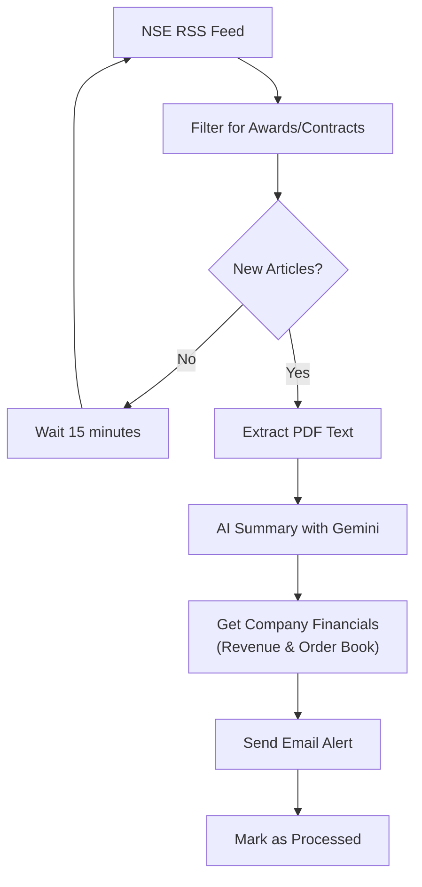

# NSE RSS Awards Processing System

## The Problem This Solves

When companies announce new orders, contracts, or awards, their stock prices often increase by 2-5% within the next 3 days. However, manually monitoring NSE announcements for these opportunities is time-consuming and inefficient. By the time you manually discover these announcements, the price movement may have already occurred.

**Real Examples:**
- Company A announces Rs. 500 crore defense contract → Stock jumps 4% in 2 days
- Company B bags Rs. 200 crore infrastructure order → Stock rises 3% overnight
- Company C wins major export deal → Stock gains 6% in first trading session

## The Solution

This automated system monitors NSE RSS feeds 24/7, instantly identifies new awards/contracts/bagging announcements, and sends you email alerts with AI-generated summaries and current stock prices. This gives you a significant time advantage to make informed investment decisions.

**What You Get:**
- Instant email alerts when relevant announcements are published
- AI-powered summaries extracting key information (order value, client, timeline)
- Company financial context (previous year's revenue, current order book size)
- Direct links to original PDF documents
- No more manual browsing through hundreds of announcements

## How It Works



## Key Features

- **Automated Monitoring**: Checks NSE announcements every 15 minutes
- **Smart Filtering**: Identifies awards, bagging, and contract announcements using keyword matching
- **AI-Powered Summaries**: Uses Google Gemini AI to summarize PDF documents with key details like order value, client, and expiry
- **Financial Context**: Uses Gemini with search grounding to find company revenue and order book data
- **Email Alerts**: Sends formatted HTML email notifications with summaries and clickable links
- **Duplicate Prevention**: Tracks processed articles to avoid repeat notifications
- **Robust Error Handling**: Comprehensive logging and error recovery mechanisms
- **Modular Architecture**: Clean, maintainable code with separate components

## Prerequisites

- Python 3.8 or higher
- Google Gemini API key (for PDF summarization)
- Email account with SMTP access (Gmail, Outlook, Yahoo, or iCloud)
- 2GB+ available disk space

## Installation

### 1. Clone or Download the Project

```bash
git clone <repository-url>
cd email_system
```

### 2. Create a Virtual Environment (Recommended)

```bash
python -m venv market_env
source market_env/bin/activate  # On Windows: market_env\Scripts\activate
```

### 3. Install Dependencies

```bash
pip install -r requirements.txt
```

### 4. Environment Configuration

Create a `.env` file in the project root with your configuration:

```env
# Email Configuration
SENDER_EMAIL=your-email@gmail.com
SENDER_PASSWORD=your-app-specific-password
RECIPIENT_EMAIL=recipient@example.com
EMAIL_PROVIDER=gmail

# Google Gemini API (for PDF summaries)
GEMINI_API_KEY=your-gemini-api-key

# Optional: Financial Data API
FINANCIAL_API_KEY=your-financial-api-key
```

### 5. Email Setup

#### For Gmail Users:
1. Enable 2-Factor Authentication
2. Generate an App-Specific Password:
   - Go to Google Account settings
   - Security → 2-Step Verification → App passwords
   - Generate password for "Mail"
   - Use this password in your `.env` file

#### For Other Providers:
- **Outlook**: Use your regular password (ensure "Less secure apps" is enabled)
- **Yahoo**: Generate an app password
- **iCloud**: Generate an app-specific password

### 6. Google Gemini API Setup

1. Visit [Google AI Studio](https://makersuite.google.com/app/apikey)
2. Create a new API key
3. Add it to your `.env` file as `GEMINI_API_KEY`

## Usage

### Quick Start (Recommended Approach)

Once you've completed the installation and configuration, start the automated scheduler. This will run continuously and check for new announcements every 15 minutes:

```bash
python scheduler.py
```

**What happens next:**
- The system immediately performs an initial check for new announcements
- It then runs every 15 minutes automatically
- When new awards/contracts are found, you'll receive email alerts within minutes
- Each email contains AI-generated summaries with key details like order value, client, and timeline

Output example:
```
RSS Awards Processor Scheduler
==================================================
Starting RSS Awards Processor Scheduler
Schedule: Every 15 minutes
Email configuration loaded successfully
Running initial check...
Scheduler is now running. Press Ctrl+C to stop.
```

### Manual Execution

Run the processor once manually:

```bash
python rss_awards_processor.py
```

### Testing Components

Test individual components:

```bash
# Test RSS fetching
python rss_fetcher.py

# Test email sending
python email_sender.py

# Test PDF summarization
python pdf_summarizer.py <pdf-url>
```

## Project Structure

```
email_system/
├── README.md                    # This file
├── requirements.txt             # Python dependencies
├── config.py                   # Configuration settings
├── .env                        # Environment variables (create this)
│
├── scheduler.py                # Main scheduler (entry point)
├── rss_awards_processor.py     # Core processing logic
├── rss_fetcher.py              # RSS feed fetching
├── filter_engine.py            # Article filtering logic
├── email_sender.py             # Email sending functionality
├── pdf_summarizer.py           # PDF text extraction and summarization
├── pdf_text_extractor.py       # PDF text extraction utilities
├── database_manager.py         # Main database operations
├── hash_database_manager.py    # Duplicate tracking
│
├── data/                       # Database files
│   └── rss_articles.db         # SQLite database
├── logs/                       # Log files (auto-created)
├── orderbook_numbers/          # Financial data tools
│   ├── financial_data_tool.py  # Stock data fetching
│   └── gemini_test.py          # AI testing utilities
│
└── __pycache__/               # Python cache (auto-generated)
```

## Configuration

You can customize the system by editing `config.py`:
- Change RSS feed URL and timeout settings
- Modify filter keywords (default: "award", "bagging", "contract")
- Adjust email template styling

## Troubleshooting

**Common Issues:**
- **Email errors**: Use app-specific passwords for Gmail, verify EMAIL_PROVIDER setting
- **RSS feed issues**: Check internet connection, NSE feed may be temporarily down
- **Gemini API errors**: Verify GEMINI_API_KEY in .env file, check API quota
- **Database locked**: Stop all running instances, check file permissions

Check log files (`scheduler.log`, console output) for detailed error information.

## License

MIT License - see LICENSE file for details. 